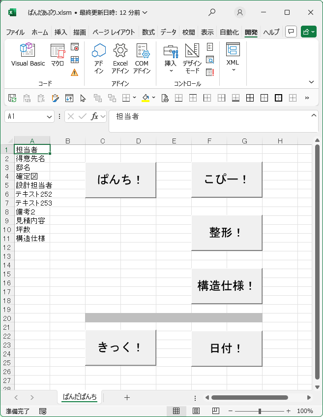
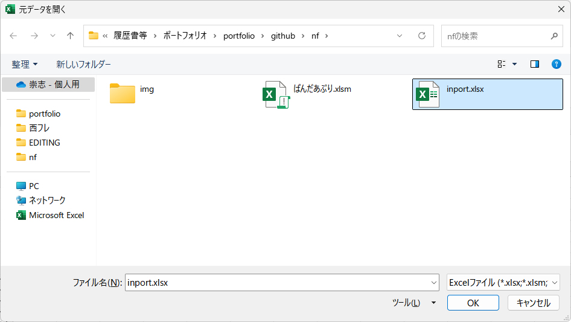
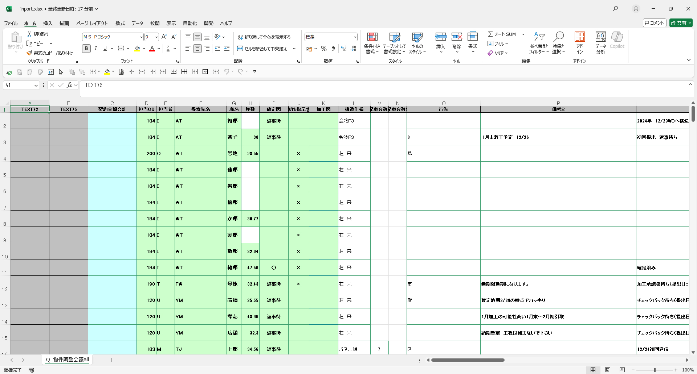
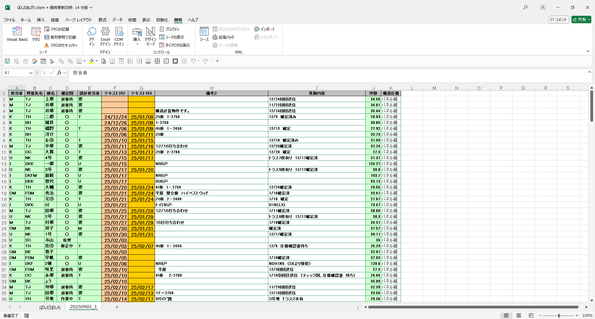

# panda-apps
ぱんだあぷり　という不思議な名前のExcelブックです。  
VBAソースと処理元ファイル置いてます。  
  
ある日妻から「こういうファイルをこんなふーにあーだこーだしてるんだけど、楽にならん？」と相談されまして。  
んで、再度操作と要望を聞き取りちゃかちゃか描いてリリース。  
ヒアリングから納品までだいたい6時間くらい。  
  
動作確認はしてますが、エラー処理やらなんやらは組んでません。  
「ひとまず動く、ちゃんと動けばミスがない」を念頭にやってます。  
  
描画止めてないのは「なんか動いてるっぽいのがかっこいい」というドナタカノヨウボウデス。  
  
とりあえずこういうことやってます、てな自己紹介替わりで。  
  
こちらが動作イメージ。  
  
  
  
  
  
